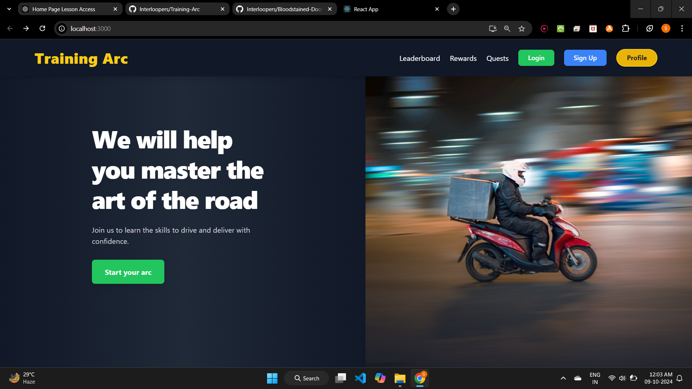
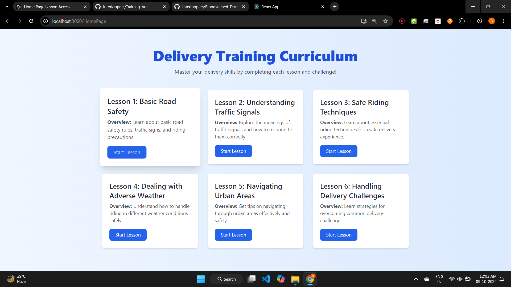
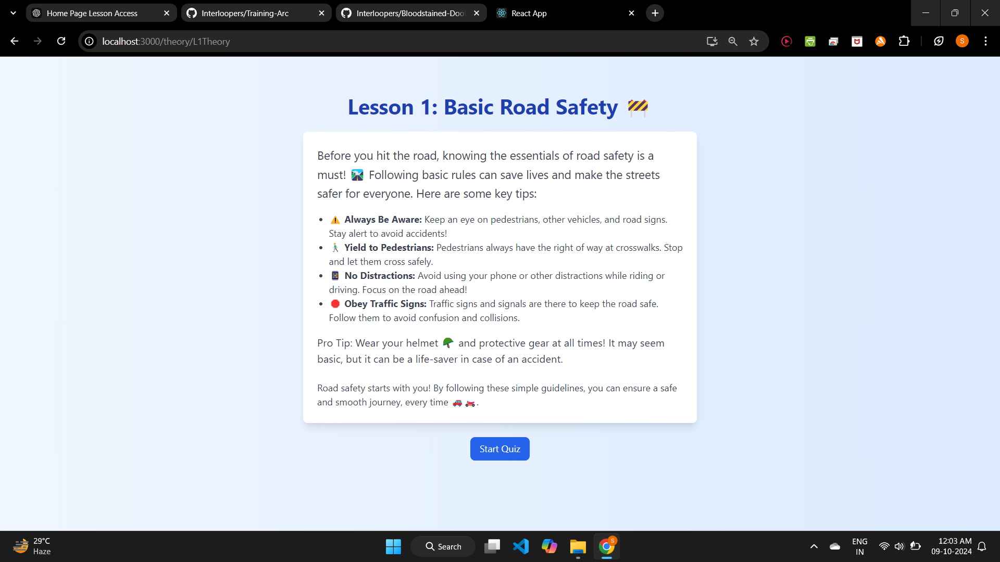
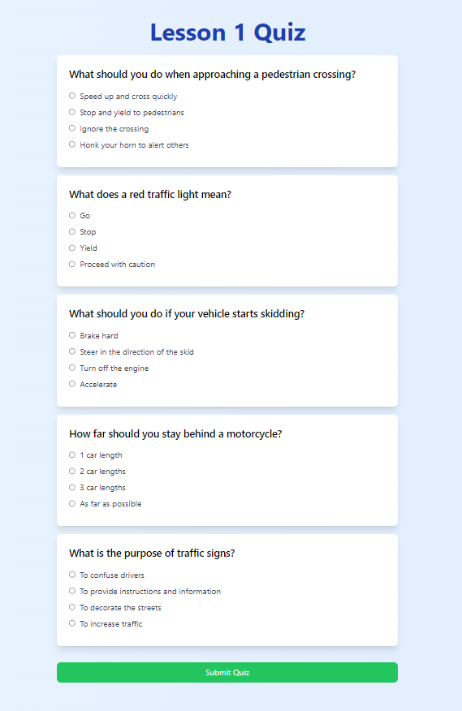
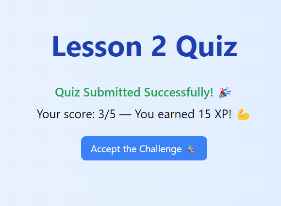
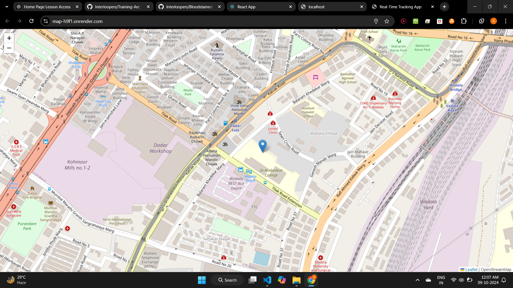
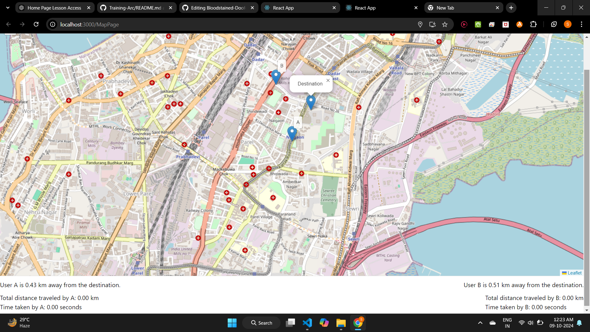
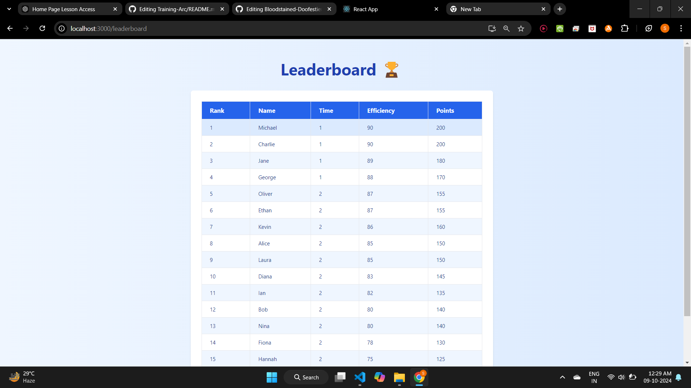
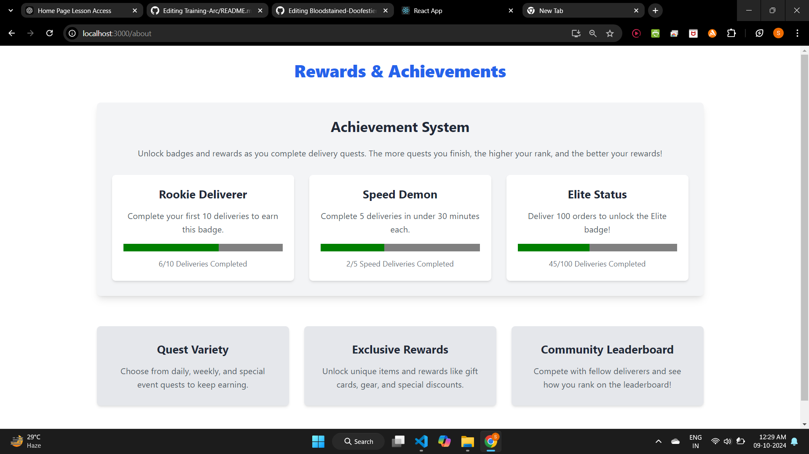
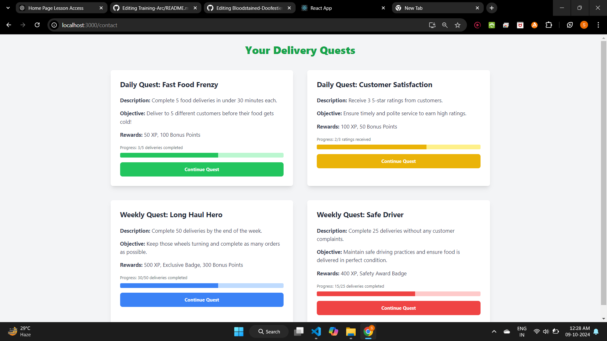

# 🚚 Delivery Training Platform

Welcome to **Delivery Training Platform** – a gamified learning app designed to train new delivery drivers to handle real-life challenges like bad weather, traffic, and more, all while keeping the learning process fun and engaging! 

---

## 🌟 Features

- **Interactive Lessons:** 📘 Simple theory lessons followed by quizzes to ensure understanding.
- **Live Map Navigation:** 🗺️ Practical tasks using **Google Maps API** and **Leaflet**, where drivers navigate from point A to point B under real-world constraints.
- **Progressive Difficulty:** 🚦 Each of the **6 lessons** gets progressively harder, preparing drivers for more challenging deliveries.
- **Gamification:** 🎮 Keep things exciting with **daily and weekly quests**, a **reward system**, and a **leaderboard** to foster a fun, competitive environment.
  
---

## 🚀 Tech Stack

- **Frontend:** React, Tailwind CSS
- **Backend:** Node.js, Express.js
- **Database:** MongoDB
- **Mapping:** Google Maps API, Leaflet.js

---

## 📋 Lessons Overview

1. **Basics of Delivery** – Understanding traffic signals and basic delivery rules.
2. **Handling Bad Weather** – Learn to deliver safely in rain, snow, and harsh conditions.
3. **Heavy Traffic Maneuvering** – Navigate through congested areas effectively.
4. **Time Management** – Improve efficiency while keeping safety in mind.
5. **Advanced Routes** – Deal with complex roadways and unexpected obstacles.
6. **Final Challenge** – Combine everything you've learned in a high-stakes delivery challenge!

---

## 🎯 Gamification System

- **Daily & Weekly Quests:** ✅ Complete tasks like delivering in specific time limits or challenging weather conditions.
- **Rewards:** 🎁 Earn points and badges to unlock new levels.
- **Leaderboard:** 🏆 Compete with other drivers to claim the top spot!

---

## 📜 **Credits**  
- **Developers**: [@Shubham_Bendre](https://github.com/Shubham-Bendre), [@Malhar_Singh](https://github.com/Malhar2400), [@Yash_Chougule](https://github.com/YxASH), [@Suyog_Sable](https://github.com/Suyog_Sable)  
- **Special Thanks**: To all the mentors and community for their support! 🎉

## 📸 **Screenshots**  

### 1️⃣ Home Page
  
### 2️⃣ Lessons Dashboard
  
### 3️⃣ Lesson
  
### 4️⃣ Quiz
  
### 5️⃣ Quiz Completion Screen
  
### 6️⃣ Live Map Location
  
### 7️⃣ Live Map Testing

### 8️⃣ Leaderboard

### 9️⃣ Rewards

### 🔟 Questes

### 11 Login

### 12 Signup


## 🕹️ **Installation**  
1. Clone the repository:  
   ```bash
   git clone https://github.com/Interloopers/Bloodstained-Doofestien.git

2. Run the main file:
